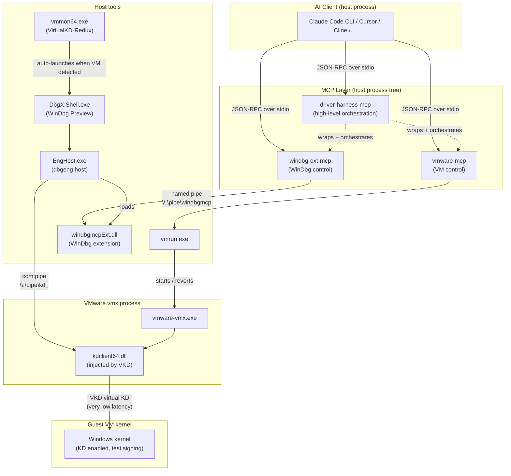

# Architecture

How `driver-harness-mcp` glues together VMware, VirtualKD-Redux, WinDbg, and MCP.

## High-level flow

## Components and their responsibility

### Layer 1 — AI client
The user-facing AI. Talks MCP. Knows nothing about kernel debugging by default,
so we feed it knowledge through `skills/`.

### Layer 2 — MCP servers (3)
| Server | Origin | Purpose |
|---|---|---|
| `vmware-mcp` | [`ZacharyZcR/vmware-mcp`](https://github.com/ZacharyZcR/vmware-mcp) | Atomic VM operations (start, stop, revert, snapshot, copy file) |
| `windbg-ext-mcp` | [`Letenz/windbg-ext-mcp`](https://github.com/Letenz/windbg-ext-mcp) (fork of NadavLor's) | Send WinDbg commands programmatically |
| `driver-harness-mcp` | This repo | High-level orchestration (e.g. `recover_to_clean_state`) |

These run as **separate processes** from the AI client (per the MCP protocol).

### Layer 3 — Host tools
- **VMware Workstation Pro** — provides `vmrun.exe`, `vmrest.exe`
- **VirtualKD-Redux** — `vmmon64.exe` watches for VMs and auto-launches the configured debugger; `kdclient64.dll` is injected into `vmware-vmx.exe` to provide a fast virtual KD transport
- **WinDbg Preview** — the actual debugger UI; `DbgX.Shell.exe` spawns `EngHost.exe` for `dbgeng` work
- **`windbgmcpExt.dll`** — our WinDbg extension (compiled from the patched `windbg-ext-mcp` source). Listens on the named pipe `\\.\pipe\windbgmcp`.

### Layer 4 — Guest VM
A standard Windows 10/11 guest configured with:
- `bcdedit /debug on` and `bcdedit /set testsigning on`
- VirtualKD's modified kernel boot loader, OR a regular `kdcom`/`kdnet` debug transport

## Two transports for kernel debugging

You can use this project with **either** transport:

| Transport | Pros | Cons |
|---|---|---|
| **VirtualKD-Redux (recommended)** | Very fast (no serial overhead), auto-launches debugger, snapshot-friendly | Only works for VMware/VirtualBox guests |
| **KDNET** | Standard Microsoft transport, works on bare metal too | Slower, more setup, firewall-sensitive |

The example workflows in this repo assume **VirtualKD-Redux**. KDNET support
is documented in [`configure-guest-vm.md`](./configure-guest-vm.md).

## End-to-end timing (typical)

| Stage | Time |
|---|---|
| `vmrun revertToSnapshot` | 1–2 s |
| `vmrun start` | 8–10 s |
| `vmmon64.exe` detects VM, launches WinDbg | 3–5 s |
| WinDbg ↔ guest KD handshake (with `-d` initial break) | 10–15 s |
| Auto-load `windbgmcpExt.dll` + `!mcpstart` | < 1 s |
| **Total: revert → MCP ready** | **~20–25 s** |

After that, every additional WinDbg command via MCP is on the order of tens of milliseconds.

## What our patches add

We maintain two patches on top of `NadavLor/windbg-ext-mcp`:

1. **SDDL pipe ACL** — lets a non-elevated MCP client (e.g. VS Code, Cursor running as the user) connect to the named pipe created by an elevated WinDbg process. Without this patch, the AI must run as Administrator.
2. **`BreakInHandler`** — programmatically interrupts a running kernel target (equivalent to clicking WinDbg's Break button), so AI can do `break_in → .crash → !analyze` without GUI interaction.

Both are intended to be submitted upstream. See [`docs/configure-vkd-redux.md`](./configure-vkd-redux.md)
and the [windbg-ext-mcp fork README](https://github.com/Letenz/windbg-ext-mcp#patches) for details.
